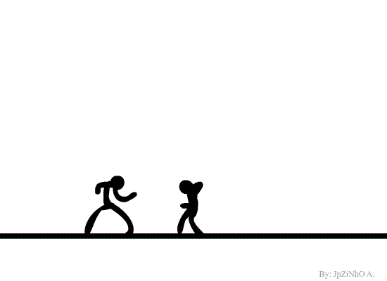

<h1 align="center">Hi 👋, I'm Lynn</h1>
<h3 align="center">Coder, Simp, Loser, Toxic</h3>

&nbsp;
&nbsp;

- 🌱 I’m currently learning **Python**
- 💬 Ask me about **Python**

&nbsp;
&nbsp;

<h3 align="left">Languages and Tools:</h3>

  </a> <a href="https://www.w3schools.com/cs/" target="_blank" rel="noreferrer">  

\
&nbsp;
\
&nbsp;

<h3 align="left">Connect with me:</h3>

&nbsp;
&nbsp;

&nbsp;

&nbsp;
&nbsp;

